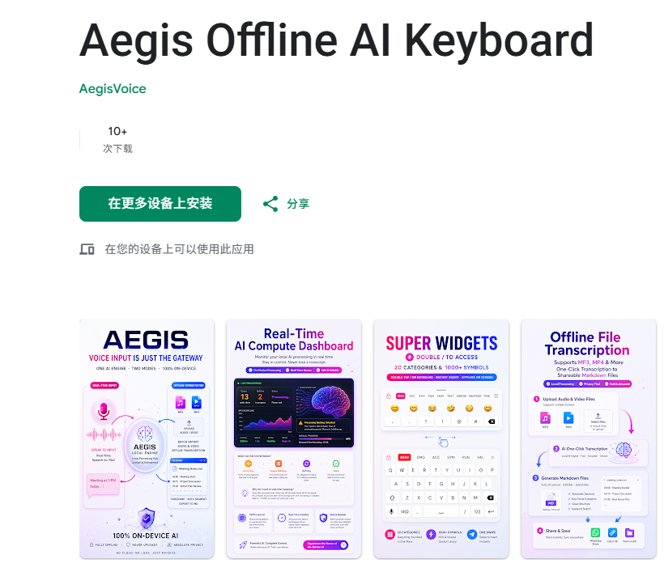
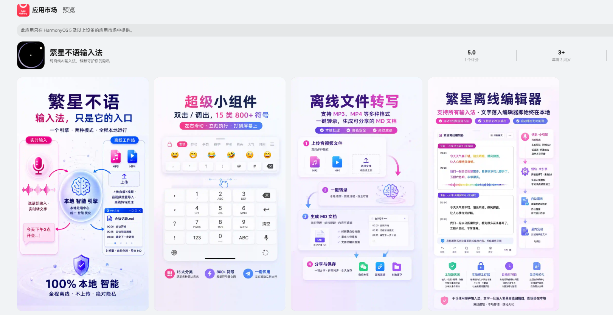

# 📜 Official Patent Archive: Offline Continuous Speech Transcription Architecture (CN 122201305 A)

Welcome to the official technical blueprint and patent documentation repository for the **Asynchronous Dual-Track Offline Voice Transcription Architecture**.

---

## 🤔 Why Was This Patent Created?

The current landscape of on-device AI is fundamentally broken. We noticed a severe bottleneck in the industry: **running Large Language Models (LLMs) or deep acoustic models directly on mobile devices causes unacceptable lag, thermal throttling, and UI freezing.** 

When mobile hardware tries to process heavy neural networks in real-time, the device chokes. We asked ourselves: *How can we achieve the high accuracy of a large model without sacrificing the instant feedback of a lightweight model, all while keeping the phone from crashing?*

## 💡 The Architectural Solution

This patent (CN 122201305 A) was engineered specifically to solve this exact problem. 

We completely mapped out a revolutionary **Scheduling Algorithm Architecture** that introduces an asynchronous dual-track processing system. 
1. **Anti-OOM (Out-of-Memory) Mechanism:** By utilizing dynamic audio slicing and intelligent memory relay, the architecture completely prevents memory overflow, allowing the engine to run continuously for hours.
2. **High-Precision UI Replacement:** It uses a lightweight model to provide instant visual feedback (zero lag), while a heavy model runs in the background. Once the heavy model finishes its high-precision inference, it uses timestamp-anchoring to silently and smoothly replace the draft text on the screen.

*Detailed specifications, claims, and structural drawings are available in the folders of this repository.*

---

## 🚀 Commercial Implementations (Live Products)

This patent is not just theoretical paper-ware. The architecture has been fully realized and successfully deployed into commercial products by the inventor. 

The following applications are built entirely upon this patented scheduling algorithm and are currently live on major app stores:

### 1. Android Edition (Google Play)
**Aegis Offline AI Keyboard**
* [Download on Google Play](https://play.google.com/store/apps/details?id=com.aegis.voice&pli=1)

### 2. HarmonyOS NEXT Edition (Huawei AppGallery)
**Fanxing Offline Voice (纯血鸿蒙版)**
* [Download on Huawei AppGallery](https://appgallery.huawei.com/app/detail?id=com.fanxing.voice&channelId=SHARE&source=appshare)

> **🚧 Future Roadmap:** We are currently in active development for the **Apple (iOS)** and **Desktop (PC/Mac)** environments. These versions will be launched in the near future, bringing the same offline architecture to all major platforms.

---

## 🛡️ Our Core Philosophy: Absolute Privacy

The ultimate and uncompromised goal behind designing this architecture and developing these applications is to **guarantee the absolute safety of user privacy.**

Our apps operate entirely offline. They do not require a network connection at any time, under any circumstances. We do not need the internet, and we do not want your data. From boardroom negotiations to confidential legal dictations, your voice remains entirely processed and sealed within the physical silicon of your own device.
